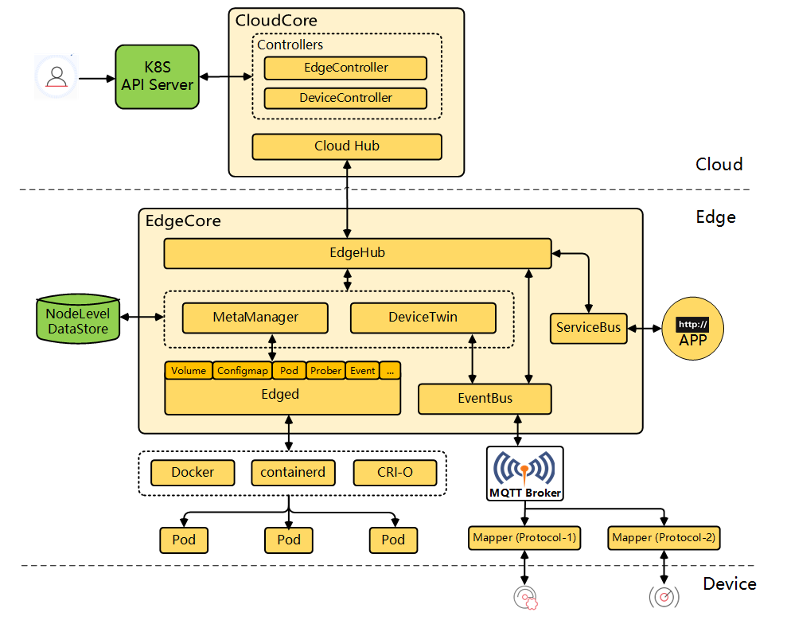
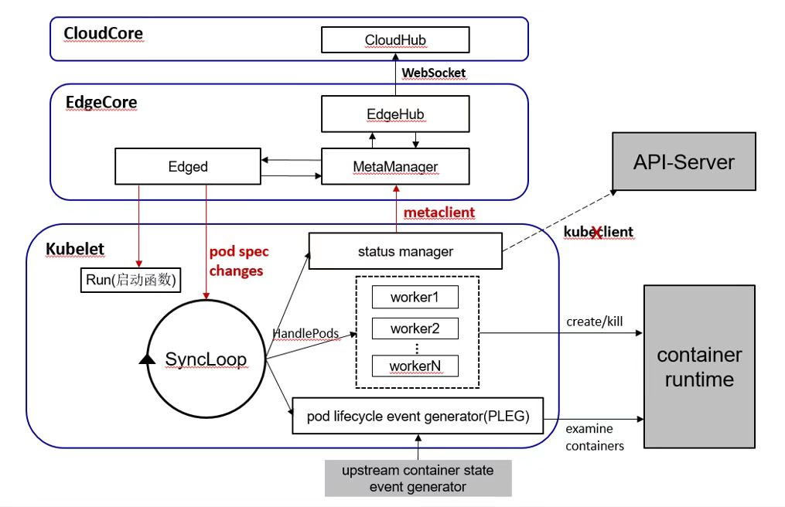

# 自定义裁剪边缘Kubelet

KubeEdge从1.12版本开始，引入了全新的轻量化边缘引擎Edged。旧版的Edged对Kubelet存在较多的侵入式修改，在版本升级、上游漏洞修复引入等工作中都带来了比较大的困难，也增加了社区用户的学习成本。

新版Edged通过调用Kubelet入口的启用函数，直接在EdgeCore中集成了原生Kubelet，为了保证边缘的轻量化，在原生Kubelet中做了优化与裁剪，并保留了裁剪历史记录（Commit History）。由于新版Edged减少了对Kubelet的侵入式修改，大大简化了后续K8s版本依赖升级，也可将上游K8s漏洞修复及时同步到KubeEdge版本。

本文将向大家介绍新版Edged工作原理，以及更新K8s依赖版本的步骤，社区开发者可以根据自身需求自定义裁剪Kubelet。

## Edged集成Kubelet

Edged作为EdgeCore的核心模块，在边缘主要负责节点和边缘应用的生命周期管理，与Kubelet功能相同。那为什么不直接在边缘节点上使用Kubelet呢？ 因为Kubelet访问ApiServer是通过list-watch机制，节点重启之后需要re-list全量资源，在网络复杂、节点经常断联重连的边缘场景下，不断地re-list会对云上的控制面带来很大的冲击，并且对边缘带宽的要求也很高。因此在KubeEdge的架构中，edged不再使用list-watch机制，而是采用了一套可靠的云边通信的消息机制，并且使用websocket或quic协议来代替原有的http请求，可以查看KubeEdge架构进一步了解。除此之外，边缘设备通常对资源占用有一定的要求，Edged对Kubelet也做了一些轻量化的工作。



本文从Edged启动Kubelet，Edged接收云端下行消息以及Edged发送上行消息三个部分来介绍Edged集成Kubelet的工作。

1.  启动Kubelet

Edged的参数中集成了Kubelet的配置参数，包括KubeletConfig和KubeletFlag：

```
/pkg/apis/componentconfig/edgecore/v1alpha2/types.go

type Edged struct {
    // Enable indicates whether Edged is enabled,
    // default true
    Enable bool `json:"enable"`
    // TailoredKubeletConfig contains the configuration for the Kubelet, tailored by KubeEdge
    TailoredKubeletConfig *TailoredKubeletConfiguration `json:"tailoredKubeletConfig"`
    // TailoredKubeletFlag
    TailoredKubeletFlag
}
```

并通过`func ConvertEdgedKubeletConfigurationToConfigKubeletConfiguration`（in `/edge/pkg/edged/config/config.go`）将edged的参数转换为Kubelet启动参数，并在Edged启动时调用`DefaultRunLiteKubelet(即kubeletserver.Run)`直接启动Kubelet。

2.  Edged接收云端下行消息

原生的Kubelet通过list-watch机制直接获取集群资源的增删改查消息，而在KubeEdge中，云上的CloudCore通过list-watch机制访问集群，并将消息发送到边缘，Edged会通过`func syncPod`等待云上下发的消息，解析消息并将其传入Kubelet监听的`PodUpdateChannel`中，进而完成边缘节点上pod的生命周期管理。

3.  Edged发送上行消息

原生的Kubelet通过调用KubeClient直接调用API-Server访问、上报或更新资源，在KubeEdge中，Edged通过KubeClientBridge将KubeClient替换为MetaClient，MetaClient接收Kubelet上报的消息，将其转换为KubeEdge定义的message并上报到云上，并将Response包装并返回给Kubelet。

```
/edge/pkg/edged/edged.go

// MakeKubeClientBridge make kubeclient bridge to replace kubeclient with metaclient
func MakeKubeClientBridge(kubeletDeps *kubelet.Dependencies) {
    client := kubebridge.NewSimpleClientset(metaclient.New())
    kubeletDeps.KubeClient = client
}
```



## 更新K8s依赖版本

EdgeCore直接集成Kubelet时，对Kubelet做了少量侵入式修改，同时为了满足轻量化的需求，对Kubelet做了一些裁剪。KubeEdge维护了一套裁剪之后的版本[KubeEdge/Kubernetes](https://github.com/kubeedge/kubernetes)，其中裁剪和修改的内容可以根据对应版本的commits追溯，以1.24.14版本的Kubernetes为例，历史记录可参见：[KubeEdge/Kubernetes:/v1.24.14-kubeedge1](https://github.com/kubeedge/kubernetes/commits/v1.24.14-kubeedge1)。开发者或者用户可以根据自己的需求继续裁剪Kubelet或者恢复部分被裁剪的特性，更换依赖的Kubernetes版本，就可以在EdgeCore集成个性化定制的Kubelet，更换步骤如下：

1.  根据自己的需求，基于KubeEdge/Kubernetes对应的版本进行自定义的裁剪或特性开发。
2.  给当前版本打上tag，并push到个人Kubernetes仓库，其中由于在kubernetes主仓中使用了公共库，公共库通过Go Module的replace机制，将版本替换为子目录./staging/src/k8s.io对应的依赖。所以在打tag这个过程中，需要同时对staging下面每个公共库都打上tag。
    参考[脚本](https://github.com/Shelley-BaoYue/kubernetes/commit/21d583cfce26c959411787084c41c34b55bbda2d#diff-7a66b79ded228c9156130cc49bc6096609162c815b2140a9e640017b4526f0bb), 指定REMOTE={个人仓库}，并执行脚本即可（脚本传参即tag名称）。
3.  修改KubeEdge的go.mod文件，在replace处将Kubernetes以及相应的staging子仓库都替换成个人仓库地址和版本号。
4.  执行go mod tidy和go mod vendor更新vendor，也可以执行KubeEdge的hack/update-vendor.sh以及hack/update-vendor-license.sh更新vendor和licenses。
5.  编译最新的KubeEdge，在本地环境调试功能。
6.  如需将个人修改提交到KubeEdge社区，可以[KubeEdge/Kubernetes](https://github.com/kubeedge/kubernetes)对应的版本release分支提交自己的修改，并将自己的验证步骤与结果附在pr中。